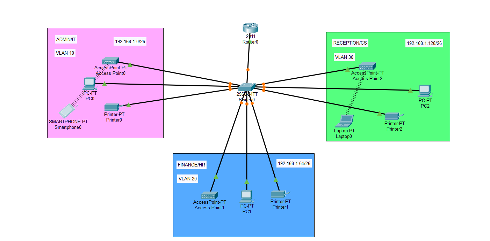

# SOHO-Ag-Tasarimi-ve-Uygulamasi

## Ağ Topolojisi



## Amaçlar

- Ağın üç farklı departmana ayrılması: **Admin/IT**, **Finance/HR**, **Customer Service/Reception**
- Her departman için ayrı bir **VLAN** yapılandırılması
- **Kablosuz ağ erişimi** sağlanması
- **DHCP** ile otomatik IP adres dağıtımı
- **Inter-VLAN yönlendirme** ile VLAN’lar arası iletişimin sağlanması


## Cihazlar

- **Router**: Cisco 2911 (Router0)
- **Switch**: Cisco 2960 (Switch0)
- **Erişim Noktaları** (Access Point) – Kablosuz cihaz bağlantısı için
- **Bilgisayarlar, Yazıcılar, Akıllı Telefonlar ve Tabletler**

## VLAN Yapılandırması

| Departman               | VLAN | IP Aralığı          | Router IP          |
|------------------------|------|----------------------|--------------------|
| Admin / IT             | 10   | 192.168.1.0/26       | 192.168.1.62       |
| Finance / HR           | 20   | 192.168.1.64/26      | 192.168.1.126      |
| Reception / Customer   | 30   | 192.168.1.128/26     | 192.168.1.190      |

## Yapılandırma Adımları

### 1. VLAN Tanımlama

```bash
Switch(config)# vlan 10
Switch(config-vlan)# name Admin_IT

Switch(config)# vlan 20
Switch(config-vlan)# name Finance_HR

Switch(config)# vlan 30
Switch(config-vlan)# name CS_Reception


### 2. Portları VLAN’lara Atama

```bash
Switch(config)# interface range fa0/1-4
Switch(config-if-range)# switchport mode access
Switch(config-if-range)# switchport access vlan 10

Switch(config)# interface range fa0/5-8
Switch(config-if-range)# switchport mode access
Switch(config-if-range)# switchport access vlan 20

Switch(config)# interface range fa0/9-12
Switch(config-if-range)# switchport mode access
Switch(config-if-range)# switchport access vlan 30


### 3. Inter-VLAN Routing (Alt Arayüzler ile)

Router(config)# interface g0/0.10
Router(config-subif)# encapsulation dot1Q 10
Router(config-subif)# ip address 192.168.1.62 255.255.255.192

Router(config)# interface g0/0.20
Router(config-subif)# encapsulation dot1Q 20
Router(config-subif)# ip address 192.168.1.126 255.255.255.192

Router(config)# interface g0/0.30
Router(config-subif)# encapsulation dot1Q 30
Router(config-subif)# ip address 192.168.1.190 255.255.255.192


### 4. DHCP Yapılandırması

Router(config)# ip dhcp pool VLAN10
Router(dhcp-config)# network 192.168.1.0 255.255.255.192
Router(dhcp-config)# default-router 192.168.1.62

Router(config)# ip dhcp pool VLAN20
Router(dhcp-config)# network 192.168.1.64 255.255.255.192
Router(dhcp-config)# default-router 192.168.1.126

Router(config)# ip dhcp pool VLAN30
Router(dhcp-config)# network 192.168.1.128 255.255.255.192
Router(dhcp-config)# default-router 192.168.1.190


## Test ve Doğrulama

- Tüm cihazlar kendi VLAN'ları içerisinde doğru şekilde IP adresi aldı.
- VLAN’lar arası ping testleri başarılı şekilde tamamlandı.
- Kablosuz cihazlar Access Point'ler aracılığıyla ağa başarıyla bağlandı.


